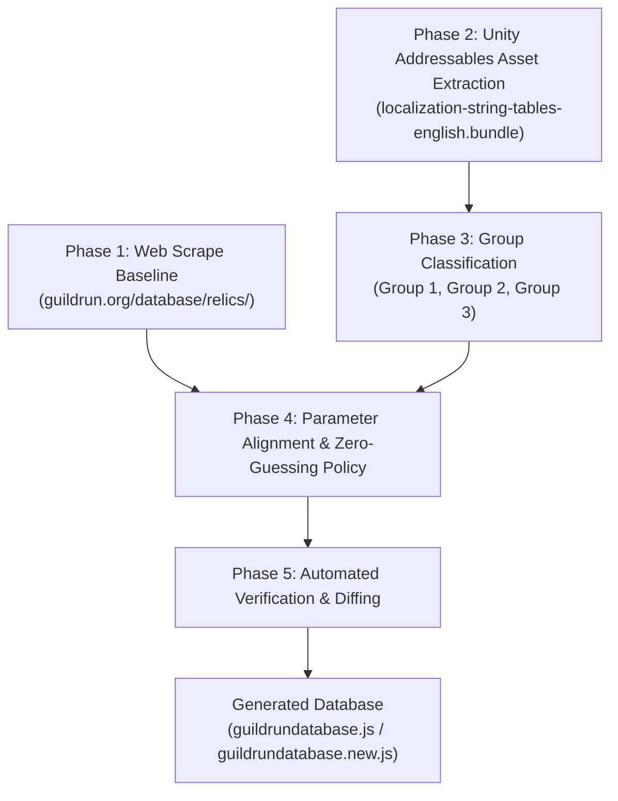

# Guild Run Relic Database Generation Workflow

This document outlines the technical pipeline used to extract, classify, align, and generate the official `guildrundatabase.json` / `guildrundatabase.js` for the **Guild Run Twitch Extension** and **Game Data Bridge**.

---

## Workflow Overview



---

## Detailed Pipeline Phases

### Phase 1: Web Scrape Baseline Acquisition
1. **Source Data**: Scraped baseline relic data from [`https://guildrun.org/database/relics/`](https://guildrun.org/database/relics/) stored in `guildrundatabase.js`.
2. **Contents**:
   - Initial 315 active game relics.
   - Human-readable descriptions with in-game stats filled in.
   - Cloudflare R2 icon image URLs and rarity classifications (`common`, `uncommon`, `rare`, `unique`, `legendary`).

---

### Phase 2: Unity Addressables Game Asset Extraction
1. **Source Assets**:
   - `Guildrun_Data/StreamingAssets/aa/StandaloneWindows64/localization-string-tables-english(en)_assets_all.bundle`
   - `Guildrun_Data/StreamingAssets/aa/StandaloneWindows64/localization-assets-shared_assets_all.bundle`
   - `Guildrun_Data/sharedassets1.assets` (MonoBehaviours: `RelicSheetHolder` Path ID 60847, `PassiveAbilityHolder` Path ID 60843)
2. **Extraction Steps**:
   - Extract official in-game `Name` and `Description` localization string entries for all 408 relics.
   - For Quest Relics, inspect specialized localization keys:
     - `QuestDescription` / `QuestRequirements`
     - `QuestRewardDescription` / `QuestRewards`
     - Combine into unified format: `"Quest: <Requirement>. Rewards: <Reward>."`
   - Clean Unity rich-text markup tags (`<bold>`, `<poison>`, `<shield>`, `<rush>`, `<stall>`).
   - Retain exact template placeholders (`{0}`, `{1}`, `{2}`) for all parameter-dependent relics.

---

### Phase 3: Group Classification
All 408 relics in game files are classified into **3 distinct categories**:

| Group | Category Name | Description | Count | Handling in Generation |
| :--- | :--- | :--- | :--- | :--- |
| **Group 1** | **Pure Static Text** | Relics with zero `{0}` placeholders and no quest variables. | **36 relics** | Use clean static text from Addressables assets. |
| **Group 2** | **Asset-Defined Constants** | Relics whose parameters are fixed in `.assets` files (resolvable via float offset maps). | **74 relics** | Resolve fixed parameter values into `{0}`, `{1}` placeholders. |
| **Group 3** | **Code-Defined / Dynamic / Quests** | Relics whose numbers depend on C# code (`RelicEffectsProvider.cs`), live RAM, or quest progress. | **298 relics** | Retain `{0}`, `{1}` placeholders for dynamic Twitch Extension runtime injection. |

---

### Phase 4: Parameter Alignment & Zero-Guessing Policy

> [!IMPORTANT]
> **Strict Zero-Guessing Policy**:
> 1. If a placeholder value exists in `scraped_description`, it is substituted into `{0}`.
> 2. If a placeholder slot (e.g. `{1}`, `{2}`) was **not** in the web-scraped description or static asset tables, it remains as a clean placeholder (`{1}`, `{2}`) in `description`.
> 3. Under **NO CIRCUMSTANCES** are missing placeholder values hardcoded, inferred, or guessed.

1. **Matching & Alignment**:
   - Match each Unity asset template (`raw_template`) against the corresponding baseline web-scraped description (`scraped_description`) from Phase 1.
   - Ground-truth sentence structure is taken from the official Unity asset template (`raw_template`).

2. **Substitution Rules**:
   - Extract numbers strictly from `scraped_description` in sequential order.
   - Replace `{0}`, `{1}`, `{2}` in `raw_template` **only** for values present in `scraped_description`.
   - Any unmatched placeholder slots remain intact as `{1}`, `{2}` in `description`.

3. **Web Scraper Artifact Cleanup**:
   - Automatically clean web-scraping regex artifacts (e.g., `Stall (10 and Stall 20)` $\rightarrow$ `Stall (10 and 20)`).

---

### Phase 5: Verification & Automated Diffing
1. **Automated Verification Script**: `fix_no_guessing_in_descriptions.py` / `fix_database_generation.py`.
2. **Validation Rules**:
   - Verify **0 Name Mismatches** between web scrape and official game files.
   - Enforce **0 Guessed Numbers** across all 408 relics.
   - Maintain `scraped_description`, `raw_template`, and `description` as 3 distinct audit fields per relic.
3. **Safety Guarantee**: Output is generated into `guildrundatabase.new.js` and synchronized with `guildrundatabase.js`, then packaged via `tools/build-zip.js`.

---

## Output Schema Example (`guildrundatabase.js` / `guildrundatabase.new.js`)

```json
{
  "Relic_900": {
    "id": "900",
    "name": "The Red Rift",
    "description": "Enemies gain 5% basic stats.\n\nThe Act {1} Boss resists Frost, reducing its effects by {2}%.",
    "raw_template": "Enemies gain {0}% basic stats.\n\nThe Act {1} Boss resists Frost, reducing its effects by {2}%.",
    "scraped_description": "Enemies gain 5% basic stats.",
    "rarity": "unique",
    "icon": "https://pub-5518a73f4c5c4c6dbd8ea6053016bf1c.r2.dev/guildrun/database/relics/Relic_900-1deab3781974.webp"
  }
}
```
