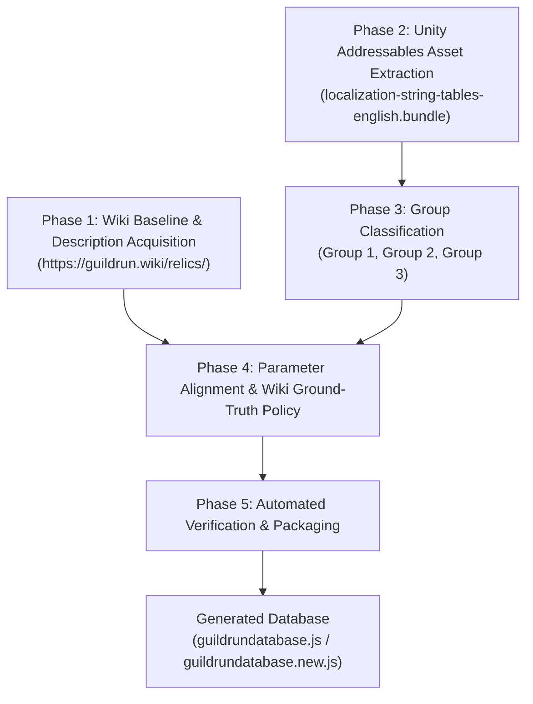

# Guild Run Relic Database Generation Workflow

This document outlines the technical pipeline used to extract, classify, align, and generate the official `guildrundatabase.json` / `guildrundatabase.js` for the **Guild Run Twitch Extension** and **Game Data Bridge**.

---

## Workflow Overview



---

## Detailed Pipeline Phases

### Phase 1: Wiki Baseline & Description Acquisition
1. **Primary Source Data**: Relic data scraped from [`https://guildrun.wiki/relics/`](https://guildrun.wiki/relics/) stored in `guildrundatabase.js`.
2. **Contents**:
   - 316 active public game relics.
   - Latest-patch human-readable descriptions, shop costs, and rarities.
   - Internal numeric Relic IDs (e.g. `Relic_1000`, `Relic_713`, `Relic_6010`) extracted from icon URLs (`/assets/icons/relic/<ID>.webp`).
   - Cloudflare R2 icon image URLs and rarity classifications (`common`, `uncommon`, `rare`, `unique`, `legendary`).

---

### Phase 2: Unity Addressables Game Asset Extraction
1. **Source Assets**:
   - `Guildrun_Data/StreamingAssets/aa/StandaloneWindows64/localization-string-tables-english(en)_assets_all.bundle`
   - `Guildrun_Data/StreamingAssets/aa/StandaloneWindows64/localization-assets-shared_assets_all.bundle`
   - `Guildrun_Data/sharedassets1.assets` (MonoBehaviours: `RelicSheetHolder` Path ID 60847, `PassiveAbilityHolder` Path ID 60843)
2. **Extraction Steps**:
   - Extract official in-game `Name` and `Description` localization string entries for all 408 relics (316 public wiki relics + 92 internal/event relics).
   - For Quest Relics, inspect specialized localization keys:
     - `QuestDescription` / `QuestRequirements`
     - `QuestRewardDescription` / `QuestRewards`
     - Combine into unified format: `"Quest: <Requirement>. Rewards: <Reward>."`
   - Clean Unity rich-text markup tags (`<bold>`, `<poison>`, `<shield>`, `<rush>`, `<stall>`).
   - Retain exact template placeholders (`{0}`, `{1}`, `{2}`) in `raw_template` for all parameter-dependent relics.

---

### Phase 3: Group Classification
All 408 relics in game files are classified into **3 distinct categories**:

| Group | Category Name | Description | Count | Handling in Generation |
| :--- | :--- | :--- | :--- | :--- |
| **Group 1** | **Pure Static Text** | Relics with zero `{0}` placeholders and no quest variables. | **36 relics** | Use clean static text from Addressables assets / Wiki. |
| **Group 2** | **Asset-Defined Constants** | Relics whose parameters are fixed in `.assets` files (resolvable via float offset maps). | **74 relics** | Resolve fixed parameter values into `{0}`, `{1}` placeholders. |
| **Group 3** | **Code-Defined / Dynamic / Quests** | Relics whose numbers depend on C# code (`RelicEffectsProvider.cs`), live RAM, or quest progress. | **298 relics** | Retain `{0}`, `{1}` placeholders for dynamic Twitch Extension runtime injection. |

---

### Phase 4: Parameter Alignment & Wiki Ground-Truth Policy

> [!IMPORTANT]
> **Wiki Ground-Truth Policy for Descriptions**:
> 1. For all relics present on [`https://guildrun.wiki/relics/`](https://guildrun.wiki/relics/), the active `description` field is populated directly from the Wiki description text.
> 2. The Unity asset ground-truth template is preserved in `raw_template` with `{0}`, `{1}`, `{2}` placeholders.
> 3. The original web-scraped baseline is preserved in `scraped_description`.
> 4. For internal/event relics not present on the Wiki (86 relics), the asset template description or clean scraped text is retained.

1. **Matching & Alignment**:
   - Match Wiki entries to internal numeric IDs via icon URLs (`/assets/icons/relic/<ID>.webp`) or name cross-referencing.

2. **Substitution Rules**:
   - `description` = Clean text from `https://guildrun.wiki/relics/`.
   - `raw_template` = Unity asset template with `{0}`, `{1}` placeholders.
   - `scraped_description` = Original scraped web baseline.

---

### Phase 5: Verification & Automated Packaging
1. **Automated Scripts**: `apply_wiki_descriptions_to_database.py` / `fix_no_guessing_in_descriptions.py`.
2. **Validation Rules**:
   - Verify 316 / 316 Wiki relic descriptions matched and updated cleanly.
   - Maintain `scraped_description`, `raw_template`, and `description` as 3 distinct audit fields per relic.
3. **Packaging**: Output is saved to `guildrundatabase.js` and `guildrundatabase.new.js`, then packaged via `tools/build-zip.js`.

---

## Output Schema Example (`guildrundatabase.js` / `guildrundatabase.new.js`)

```json
{
  "Relic_6002": {
    "id": "6002",
    "name": "Bossy",
    "description": "Quest: Win 6 combats. Reward: Gain 40 Shards.",
    "raw_template": "Quest: Win {0} combats. Rewards: Gain {0} Shards.",
    "scraped_description": "Quest: Win 6 combats. Rewards: Gain 50 Shards.",
    "rarity": "unique",
    "icon": "https://pub-5518a73f4c5c4c6dbd8ea6053016bf1c.r2.dev/guildrun/database/relics/Relic_6002-8240076fe52f.webp"
  }
}
```
